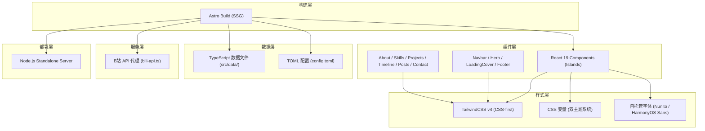

## 1. 架构设计



## 2. 技术说明

| 类别 | 技术选型 | 说明 |
|------|---------|------|
| 框架 | Astro 7 | 静态站点生成，Islands 架构 |
| UI框架 | React 19.1 | 交互组件，client:load / client:visible 按需加载 |
| 样式 | TailwindCSS 4.3.3 | CSS-first 配置，零配置文件，@theme 设计令牌 |
| 组件系统 | shadcn/ui (自生成) | button、input、textarea、badge、card 等 |
| 图标 | Font Awesome 7 (React版) | 品牌图标 + 实心图标 |
| 字体 | Nunito + HarmonyOS Sans SC | 均为自托管（本地 WOFF2/TTF） |
| 配置 | TOML (smol-toml) | 个人信息、B站 UID、社交链接 |
| 包管理 | pnpm | 快速、节省空间 |
| 部署 | Node.js Standalone (@astrojs/node) | 生成至 dist/ 目录 |

## 3. 主题系统

项目实现了**双主题系统**，通过 CSS 变量 + `data-theme` 属性切换。

### 主题列表

| 主题名 | 设计风格 | 字体 | 强调色 | 导航布局 | 背景 |
|--------|---------|------|--------|---------|------|
| MiniMal | 纯黑极简 | Nunito | 金色 (#d4a843) | 顶部固定导航栏 | 纯黑 |
| EndField | 工业科技感 | HarmonyOS Sans | 黄色 (#fffa00) | 左侧悬浮伸缩侧边栏 | 中性深灰 |

### 实现机制
- CSS 变量定义于 `@theme` 块（默认值）和 `[data-theme="..."]` 选择器（主题覆盖）
- `ThemeToggle` 组件通过 `localStorage` 持久化主题选择
- `Layout.astro` 内联脚本在页面渲染前读取 `localStorage` 设置 `data-theme`
- 侧边栏宽度通过 `--sidebar-width` CSS 变量驱动 main/footer 偏移动画

## 4. 路由定义

| 路由 | 页面 | 说明 |
|------|------|------|
| / | 主页 | 包含所有模块的单页 |
| /api/bili-api | B站 API 端点 | 头像代理 + 直播状态检测 |

## 5. API 服务

**文件**: `src/pages/api/bili-api.ts`

| 参数 | 功能 | 外部API |
|------|------|---------|
| `?action=avatar&uid=...` | 头像图片代理（解决浏览器 CORS/ORB 拦截） | `api.bilibili.com/x/web-interface/card` |
| `?uid=...&roomId=...` | 直播状态检测 | `api.live.bilibili.com/room/v1/Room/get_info` |

- 头像 URL 缓存 1 小时减少请求频率
- 直播检测限制 5 分钟/次

## 6. 字体系统

| 字体 | 用途 | 文件 | 字重 |
|------|------|------|------|
| Nunito | MiniMal 主题显示/正文 | `/fonts/nunito-latin.woff2` (自托管变量字体) | 200-1000 |
| HarmonyOS Sans SC Full | EndField 主题显示/正文 | `/fonts/HarmonyOS_Sans.ttf` (官方完整可变字体) | 100-900 |

- 均不使用 Google Fonts CDN，完全本地化
- 通过 `var(--font-display)` 和 `var(--font-sans)` CSS 变量引用

## 7. 布局结构

```
Layout.astro
  ├── LoadingCover (client:load, EndField 主题加载动画)
  ├── Navbar (client:load)
  │   ├── [MiniMal] 顶部固定导航栏
  │   └── [EndField] 左侧悬浮伸缩侧边栏
  │       ├── Logo (YLOVEXLN)
  │       ├── 导航项 (Profile / Repository / Contact)
  │       └── ThemeToggle
  ├── Hero (client:load, 首屏)
  ├── About
  ├── Skills
  ├── Projects
  ├── Timeline
  ├── Posts
  ├── Contact
  └── Footer
```

## 8. 数据模型

### 8.1 数据类型定义

```typescript
// 个人信息
interface Profile {
  name: string
  avatar: string
  title: string
  bio: string
  stats: Stat[]
  socials: SocialLink[]
}

// 统计数据
interface Stat {
  label: string
  value: string | number
}

// 社交链接
interface SocialLink {
  name: string
  url: string
  icon: string
}

// 技能分类
interface SkillCategory {
  category: string
  skills: Skill[]
}

interface Skill {
  name: string
  level?: number // 1-5
}

// 项目
interface Project {
  title: string
  description: string
  image?: string
  tags: string[]
  url?: string
  github?: string
}

// 时间线条目
interface TimelineItem {
  date: string
  title: string
  subtitle: string
  description: string
  type: 'work' | 'education'
}

// 动态/文章
interface Post {
  date: string
  title: string
  summary: string
  url?: string
}

// 联系表单
interface ContactForm {
  name: string
  email: string
  message: string
}
```

### 8.2 数据结构

- 所有数据存储于 `src/data/` 目录下的 TypeScript 文件中
- 个人数据和社交链接从 `config.toml` 通过 `smol-toml` 解析
